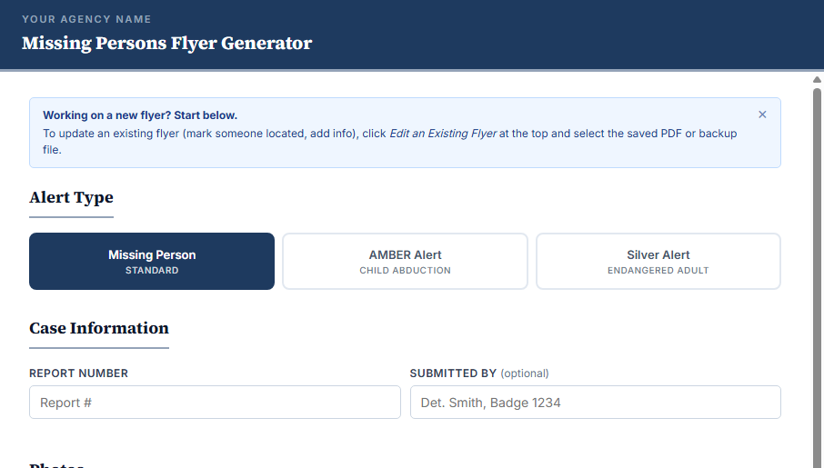
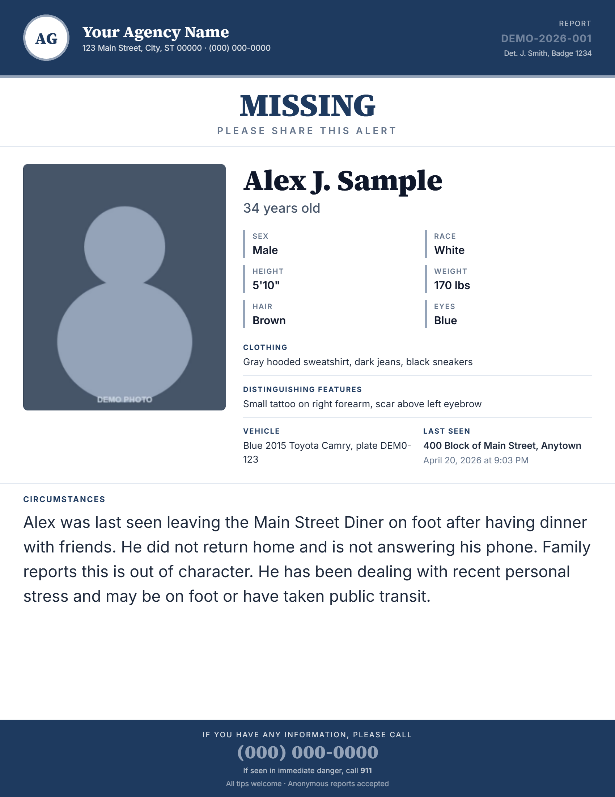
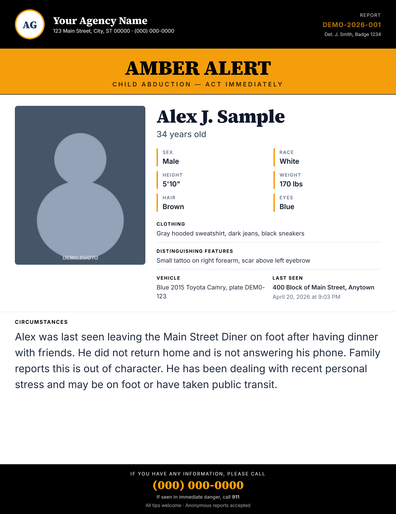
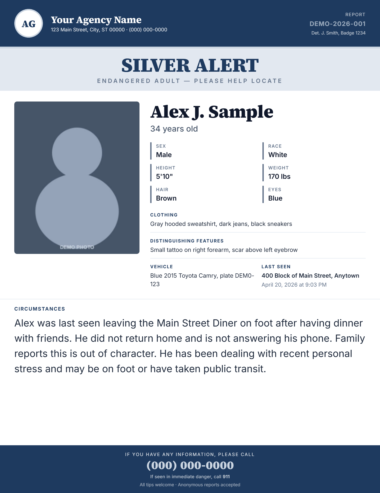
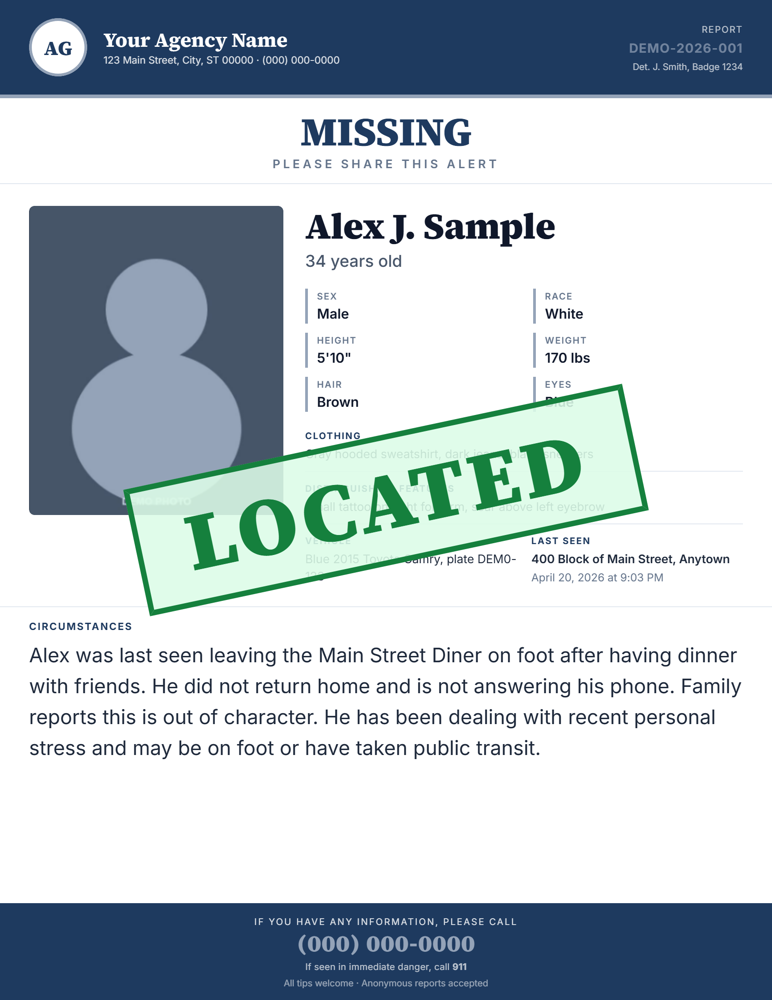

# Missing Persons Flyer Generator

A single-file HTML tool for law enforcement agencies to generate standardized, professional missing persons flyers in minutes. Create flyers for Missing Person, AMBER Alert, and Silver Alert cases with a clean, keyboard-first interface designed for patrol deputies and detectives.

## Screenshots











## Why This Exists

Inconsistent flyers undermine search efforts. Missing persons flyers vary wildly between agencies and even within the same agency — different fonts, layouts, missing fields, poor printing. A missing person case deserves a professional, consistent flyer. This tool was built to solve that problem: drop a single file onto any web server (or open it locally) and your agency has a professional, WCAG AA-compliant flyer generator in under 5 minutes.

## Features

- **Three alert types** — Missing Person (agency colors), AMBER Alert (black/amber), Silver Alert (navy/silver). Each type enforces required fields.
- **Form-driven flyer generation** with live preview. Empty fields hide automatically.
- **Photo upload & repositioning** — up to 4 photos with drag-to-reposition, zoom slider. Photos downscale on upload (max 1200px, strips EXIF for privacy).
- **Multiple export formats** — PDF (Letter, Instagram 4:5, Square 1:1), PNG, Print-ready.
- **Copy for Social Media** — generates formatted text with emojis ready to paste into Facebook, X, Nextdoor.
- **"Located" overlay** — mark the person found with a diagonal green banner.
- **Edit existing flyers** — drag a saved PDF or JSON backup into the tool to reload and update (e.g., mark located, add info).
- **Auto-save** — all form state persists in browser localStorage. Tab crash won't lose your work.
- **Demo mode** — "Try a Demo" fills realistic placeholder data so new users see how it works.
- **Keyboard shortcuts** — Ctrl+S = PDF, Ctrl+Shift+S = PNG, Ctrl+P = Print.
- **WCAG AA compliant** — all colors tested for contrast, color-blind safe (alert types differentiated by text + luminance, not color alone).
- **No backend required** — single static HTML file. Works on IIS, GitHub Pages, a USB drive, or your local machine.

## For Deputies

If you're a patrol deputy, detective, or officer using this tool in the field, see the [**User Guide**](docs/USER-GUIDE.md) for step-by-step instructions, keyboard shortcuts, and a printable one-page cheat sheet you can tape to your MDC.

## Quick Start

### 1. Open the app

- Download or clone this repo
- Open `index.html` in any modern browser (Chrome, Edge, Firefox, Safari)
- Optionally: drop it on any web server (IIS, GitHub Pages, S3, etc.)

### 2. Configure your agency

Open `index.html` in a text editor and find the `AGENCY` object near the top of the `<script>` block:

```javascript
const AGENCY = {
  name: "Your Agency Name",
  shortTag: "YOUR AGENCY NAME",
  address: "123 Main Street, City, ST 00000",
  tipLine: "(000) 000-0000",
  emergencyLine: "911",
  logoUrl: "",
  initials: "AG"
};
```

Also update the CSS variables for your brand colors:

```css
:root {
  --agency-primary: #1e3a5f;     /* Your primary brand color */
  --agency-accent:  #94a3b8;     /* Your accent color */
}
```

See `examples/agency-config-examples.md` for sample configurations from different agency types.

### 3. Start generating flyers

- Fill out the form (name, age, last seen location, etc.)
- Watch the preview update live on the right
- Hit PDF or PNG to export, or Print for printing directly
- That's it.

## How to Customize

### Colors & Fonts

Edit the CSS variables at the top of the `<style>` block. All colors are WCAG AA tested for contrast.

### Logo

Set `logoUrl` in the `AGENCY` object to a path (relative or absolute) to your logo image. Or leave it blank to use agency initials.

### Agency Name & Contact

Update `AGENCY.name`, `AGENCY.address`, `AGENCY.tipLine`, and `AGENCY.emergencyLine` — these appear on every flyer.

### Required Fields

The code enforces different required fields based on alert type:

- **Missing Person**: Name, age, last seen location
- **AMBER Alert**: plus suspect description, suspect vehicle
- **Silver Alert**: plus medical/cognitive condition

Modify the `validateForm()` function in the `<script>` block to change validation rules.

## Deployment Options

### Option 1: Run Locally (No Server)

- Open `index.html` in a browser. That's it.
- Auto-save works. PDFs can be exported and shared.

### Option 2: GitHub Pages (Free Hosting)

- Fork this repo to your own GitHub account
- In repo Settings → Pages, set Source to `main` branch
- Your flyer generator is live at `https://yourusername.github.io/missing-persons-flyer-generator/`
- No server maintenance. GitHub keeps it running.

### Option 3: IIS on Windows Server (Most Agencies)

See `docs/DEPLOY.md` for detailed IIS setup — most agencies run Windows, so this is covered in depth there.

### Option 4: Network Drive or USB

- Copy `index.html` to a shared drive or USB
- Users open it directly from File Explorer
- Auto-save works. PDFs export to their machine.

For more details on all deployment methods, architecture, and troubleshooting, see `docs/DEPLOY.md`.

## Known Limitations

1. **Re-saved PDFs lose embedded data** — if a deputy opens the flyer PDF in Adobe Acrobat and re-saves it, the JSON metadata is stripped. Use the sidecar `.json` backup file (downloaded alongside the PDF) to restore. See `docs/LIMITATIONS.md` for details.
2. **Large photos can hit localStorage limits** — photos are auto-downscaled on upload to prevent this, but four full-resolution photos might exceed limits on some older browsers. If this happens, export before closing.
3. **Shared MDC shows last user's draft** — on a shared mobile data computer, auto-save persists the last deputy's draft. Deputies should click "Clear Form" when done.
4. **Single-flyer session** — only one flyer active at a time in browser memory. No multi-case dashboard or database.
5. **Agency colors not auto-validated** — if an agency sets a very light primary color with white text, contrast could fail WCAG standards. Default colors are tested and compliant.

See `docs/LIMITATIONS.md` for full details and workarounds.

## For Agencies

This tool is built **for** law enforcement. Once you fork it, you own your copy. No attribution required, no vendor lock-in, no backend. It's yours to modify, self-host, and maintain.

If you're an agency IT staff member: deploy this to your IIS server, Active Directory, or network drive. Update the colors and agency info once. Your deputies get a professional flyer generator at zero cost. [DEPLOY.md](docs/DEPLOY.md) has step-by-step instructions for Windows Server.

## Contributing

Found a bug? Have a suggestion? Open an issue or submit a pull request. This is a living tool for law enforcement — improvements help everyone.

## License

MIT License. See [LICENSE](LICENSE) for details.

---


**Built for the frontline.** *If you're a law enforcement officer using this tool, thank you for the work you do.*
